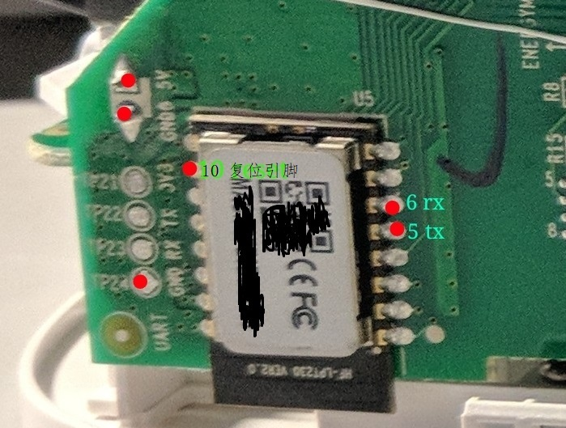
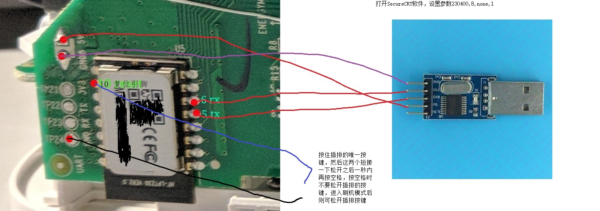
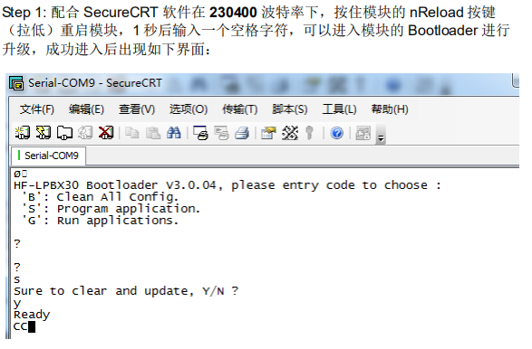
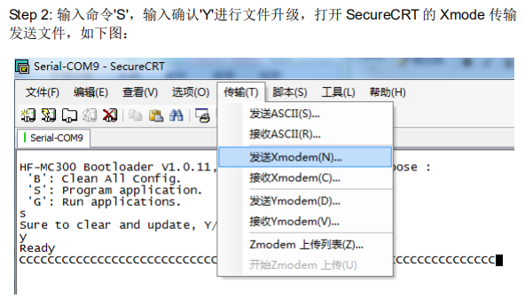
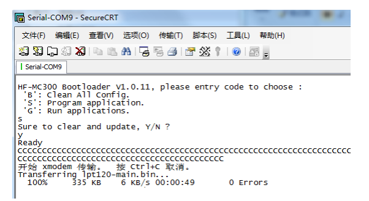
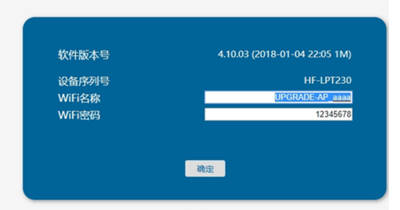
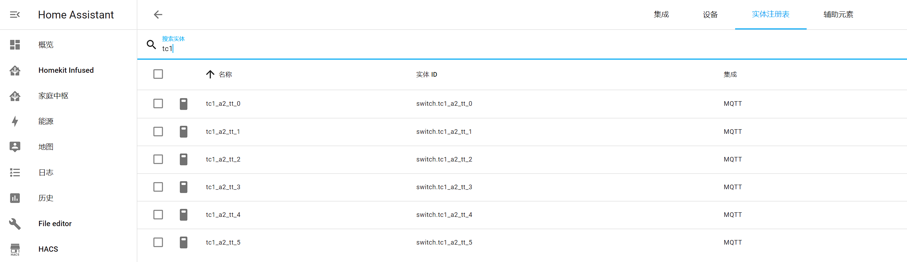
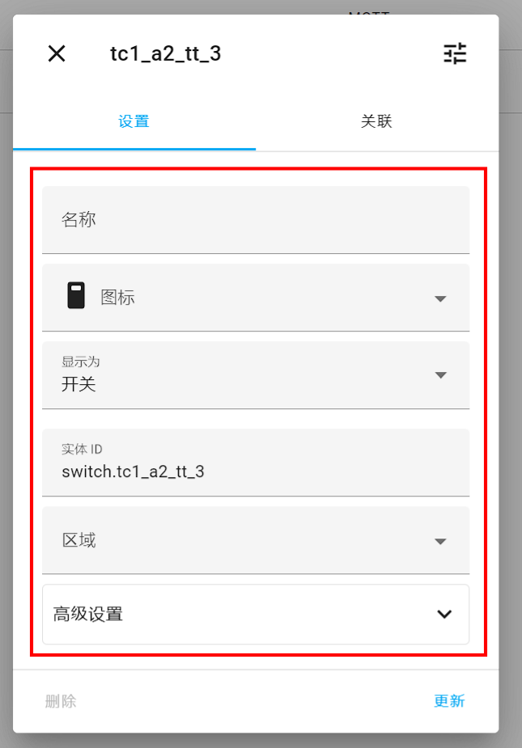
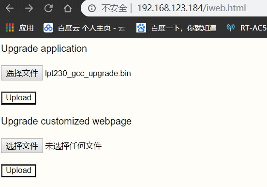

phicomm_tc1_a2
=================

## 项目介绍  
斐讯插排 TC1 A2 版本固件。  
### 支持功能：
* 通过 mqtt 自动发现接入 homeassistant
* 独立控制每个插口开关
* 每个插口支持 5 个独立的定时任务，可按周几重复
* 断电重启后，开关自动恢复至断电前的状态
* 在线升级固件
* 可通过 mqtt 消息修改配置、控制开关
* 可通过 http 接口修改配置、控制开关

### 参考项目：  
* https://github.com/IoTDevice/phicomm_tc1_a2
* https://github.com/linlyv/TC1_A2
* https://github.com/a2633063/zTC1

## 使用方法(引用自https://github.com/linlyv/TC1_A2)

刷过其他固件的机器可通过网页升级固件，原装机器需要拆机。
### 1. 接线：

把第10号引脚（复位引脚）接跟线出来，串口接第5（tx）和第6引脚(rx)，电源供电引线最好接5V（测试点）,烧录固件时不要接220V交流电

通过串口工具连接到电脑，打开secureCRT软件，设置参数230400,8,none,1 ，连接上模块。

> 图1 要接线的点（用到的点）

> 图2 接线示意图

注意：芯片的引脚 6rx 接 STL 的 TX，5tx 接 STL 的 RX。接反了不会造成什么后果，只是进不了 BootLoader，换回来就好了。

### 2. 烧录固件

按住板上的按键，另一只手把复位引线碰一下GND(测试点)，接着在1秒内按电脑上的空格键（鼠标光标要在接收窗口上）。

看到有打印出Bootloader的信息，接着按照输入‘S’，再输入‘Y’,  点击菜单栏的"传输"(Transfer)，选择“发送Xmodem”，然后就选择[lpt230_gcc.bin](https://github.com/yakinchang/phicomm_tc1_a2/releases/)文件，打开。

等待传输完成即可。

### 3.配网

* 固件烧录完成后，插排会自动重启
* 短按插排按钮检查插排是否正常，按一下全开再按一下全关（按键时间要在 0.1 秒以上，太快了无效），有问题就重刷一下固件
* 长按按键 8 秒以上，直到按键灯亮1秒后熄灭，松开按键，此时再按是没反应的，说明已经进入SmartLink配网模式
* 移步至 release ，下载 Smartlink 压缩包，根据自己的手机型号安装安卓或者 ISO 版本，配网（压缩包中有使用方法）
* app 提示配网成功后，插排会自动重启，如联网失败，长按按键尝试重新配网

### 4. 固件配置

* 获取插排分配到的 IP（根据自己的网络环境自行解决），IP 以 192.168.64.172 为例
* 访问插排的 http 接口，获取插排状态，用户名密码都是 admin
* 支持的接口列表：
    * 修改和查询wifi：http://192.168.64.172
    
    
    * 查看 mqtt 和开关状态：http://192.168.64.172/status
    * 查看开关定时任务信息（最后一位 0~5）：http://192.168.64.172/task?plug=0
    * 重启插排：http://192.168.64.172/restart
* 修改 mqtt 配置：
    * http 接口：http://192.168.64.172/config?json= 后续接序列化的json字符串，需要保证 json 字符串格式正确
    * 例如：http://192.168.64.172/config?json={"setting":{"name":"tc1_a2_tt","mqtt_uri":"192.168.64.201","mqtt_user":"test","mqtt_password":"test"}}
    * 参数说明：
        * name：设备名，可自行设置，不支持中文。用于 mqtt client ID 和 mqtt 自动发现的设备名前缀
        * hass_topic：homeassistant 自动发现监听的 topic 前缀，一般默认是 "homeassistant"，不修改可省略
        * mqtt_uri: mqtt broker IP
        * mqtt_port: mqtt 端口号，默认 1883，不修改可省略
        * mqtt_user: mqtt 用户名，默认 admin，不修改可省略
        * mqtt_password: mqtt 密码，默认 admin，不修改可省略
    * 修改后重启插排（访问 http://192.168.64.172/restart 可重启）
    * 如果配置正确，此时应该能在 homeassistant mqtt 集成中看到自动上报的开关实体，实体的各个属性都能在 homeassistant 中修改
    
    

* 定时任务设置：
    * http 接口：http://192.168.64.172/config?json= 后续接序列化的json字符串，需要保证 json 字符串格式正确
    * 例如：http://192.168.64.172/config?json={"plug_0":{"status":1,"setting":{"task_0":{"hour":22,"minute":37,"second":0,"repeat":255,"action":0,"enable":1}}}}
    * 参数说明：
        * plug_0：接口序号，根据要设置的插口序号修改，支持 plug_0 ~ plug_5
        * status：开关，1：打开，0：关闭
        * setting: 任务配置
            * task_0：任务序号，根据要设置的任务序号修改，支持 task_0 ~ task_4
            * hour、minute、second：定时任务的时间，24小时制，北京时间
            * repeat：任务是否重复执行配置
                * 是一个 8 位二进制数
                * 前 7 位为生效的星期数，从前到后依次为周 7 6 5 4 3 2 1，1：生效，0：不生效
                * 最后一位 1：一直重复，0：不重复，执行一次后关闭任务
                * 例如：193 = 0b00111111，每周 12345 任务执行，周六周日不执行
                * 二进制转10进制工具：https://www.sojson.com/hexconvert/2to10.html
                * 看不懂就设置 0 是不重复，255 是每天重复
            * action：任务内容，1：打开开关，0：关闭开关
            * enable：是否启用任务，1：启用，0：关闭
* 修改 mqtt 配置和定时任务的接口，通过 mqtt 把相同的 json 串发送到 topic：homeassistant/switch/tc1_a2_tt/config/cmd 同样生效。其中的 homeassistant、tc1_a2_tt 根据 mqtt 配置修改成自己的参数

### 5.固件升级

* web网页升级：只需要访问模块的ip地址+iweb.html(例如：http://192.168.123.184/iweb.html)，就可以打开升级页面，选择第一项Upgrade application，浏览文件选择“[lpt230_gcc_upgrade.bin](https://github.com/yakinchang/phicomm_tc1_a2/releases)”文件，点击Upload即可，传输成功会返回：Update successful !

